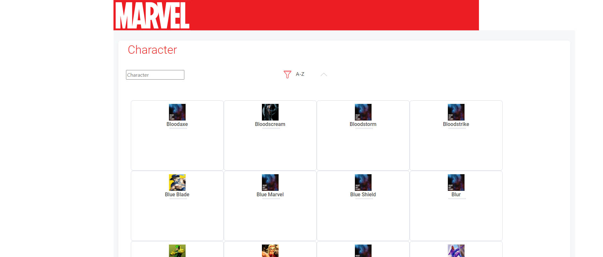

# MarvelAngularApp

This project was generated with [Angular CLI](https://github.com/angular/angular-cli) version 6.0.0 and Typescript along .Net MVC.
It implements a SPA (Single Page Application) functionality front and back end using Marvel's API (https://developer.marvel.com/).

## Enviroment Variables

To get it working you must specify three enviroment variables, as you might have them from your Developer's Marvel account:

MARVEL_PRIVATE_KEY
MARVEL_PUBLIC_KEY
MARVEL_API_KEY

If you are using Visual Studio Community, you can also set then under debugging setup, as follow:

In the Solution Explorer:
- select the startup project
- right click it - select Properties
- select Configuration Properties/Debugging or Debug in the settings tree in the left pane
- select Environment in the left column, then click the "down arrow" and select <Edit...>
- the Environment dialog should appear.
- in the top edit box set the environment variables.

## Notes on Further Developments

It's plenny of room for improvement, like the bootstrap layout, make it more responsive to mobile first approaches, etc.
Filtering functionality yet to be concluded.

## Development server

Run `ng serve` for a dev server. Navigate to `http://localhost:4200/`. The app will automatically reload if you change any of the source files.

## Code scaffolding

Run `ng generate component component-name` to generate a new component. You can also use `ng generate directive|pipe|service|class|guard|interface|enum|module`.

## Build

Run `ng build` to build the project. The build artifacts will be stored in the `dist/` directory. Use the `--prod` flag for a production build.

## Running unit tests

Run `ng test` to execute the unit tests via [Karma](https://karma-runner.github.io).

## Running end-to-end tests

Run `ng e2e` to execute the end-to-end tests via [Protractor](http://www.protractortest.org/).

## Further help

To get more help on the Angular CLI use `ng help` or go check out the [Angular CLI README](https://github.com/angular/angular-cli/blob/master/README.md).
